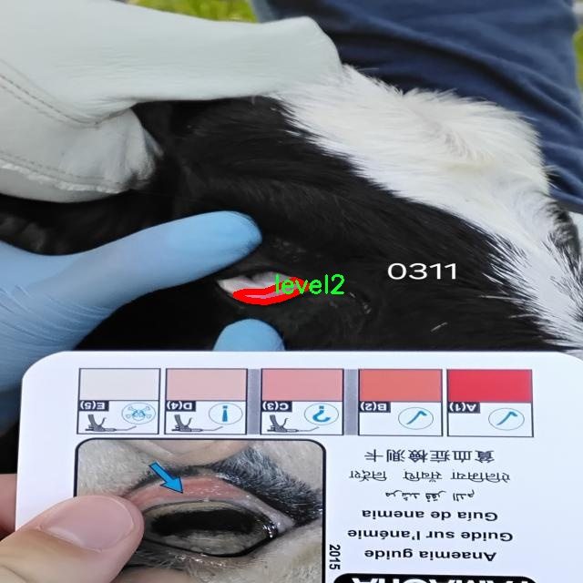

# 【贫血检测卡】牛贫血症程度分级眼睑图像分割系统： yolov8-seg-C2f-Faster-EMA

### 1.研究背景与意义

[参考博客](https://gitee.com/YOLOv8_YOLOv11_Segmentation_Studio/projects)

[博客来源](https://kdocs.cn/l/cszuIiCKVNis)

研究背景与意义

牛贫血症是一种由多种因素引起的疾病，严重影响牛的健康和生产性能，进而对养殖业造成显著经济损失。该疾病的早期诊断和分级对于制定有效的防治措施至关重要。传统的诊断方法往往依赖于兽医的经验和专业知识，主观性较强，且耗时较长，难以满足现代养殖业对快速、准确检测的需求。因此，开发一种高效、自动化的牛贫血症检测系统显得尤为重要。

近年来，计算机视觉和深度学习技术的迅猛发展为医学影像分析提供了新的解决方案。YOLO（You Only Look Once）系列模型因其在目标检测和分割任务中的高效性和准确性而受到广泛关注。YOLOv8作为该系列的最新版本，进一步提升了模型的性能，尤其在处理复杂背景和多目标检测方面表现出色。然而，针对牛贫血症的特定应用场景，现有的YOLOv8模型仍需进行改进，以适应眼睑图像分割的需求。

本研究旨在基于改进的YOLOv8模型，构建一个针对牛贫血症程度分级的眼睑图像分割系统。我们使用的新组合数据集包含2200张图像，涵盖了五个不同的贫血症级别（level1至level5），为模型的训练和验证提供了丰富的样本。这一数据集的构建不仅为研究提供了坚实的基础，也为后续的模型优化和应用提供了参考。通过对眼睑图像的精确分割，我们能够更好地提取与贫血症相关的特征，从而实现对牛贫血症的自动化检测和分级。

该系统的实现具有重要的理论和实践意义。首先，从理论上讲，通过对YOLOv8模型的改进，我们能够深入探讨深度学习在医学影像分析中的应用潜力，推动相关领域的研究进展。其次，从实践角度来看，该系统将为养殖业提供一种高效、准确的检测工具，帮助养殖户及时发现和处理牛贫血症，降低经济损失，提高牛群的整体健康水平。此外，该系统的成功应用还可以为其他动物疾病的检测提供借鉴，推动动物医学和兽医技术的发展。

综上所述，基于改进YOLOv8的牛贫血症程度分级眼睑图像分割系统的研究，不仅填补了当前在该领域的技术空白，也为养殖业的可持续发展提供了新的解决方案。通过本研究，我们希望能够为牛贫血症的早期诊断和防治提供有力支持，推动相关技术的进一步发展和应用。

### 2.图片演示


注意：本项目提供完整的训练源码数据集和训练教程,由于此博客编辑较早,暂不提供权重文件（best.pt）,需要按照6.训练教程进行训练后实现上图效果。

### 3.视频演示

[3.1 视频演示](https://www.bilibili.com/video/BV1UZ6AYwEsr/)

### 4.数据集信息

##### 4.1 数据集类别数＆类别名

nc: 5
names: ['level1', 'level2', 'level3', 'level4', 'level5']


##### 4.2 数据集信息简介

数据集信息展示

在现代医学影像分析中，数据集的构建与优化对于疾病的早期检测和准确诊断至关重要。本研究围绕“新组合数据集”（new_combined_dataset）展开，旨在改进YOLOv8-seg模型，以实现对牛贫血症程度的精准分级和眼睑图像的有效分割。该数据集专门设计用于训练一个高效的分割系统，能够识别和分类不同程度的牛贫血症，从而为兽医提供更为可靠的诊断依据。

“新组合数据集”包含五个类别，分别为“level1”、“level2”、“level3”、“level4”和“level5”。这些类别代表了牛贫血症的不同严重程度，涵盖了从轻度贫血到重度贫血的各个阶段。通过对这些不同级别的图像进行标注和分类，研究团队能够为模型提供丰富的训练样本，使其在处理实际病例时具备更高的准确性和鲁棒性。

在数据集的构建过程中，研究者们收集了大量的牛眼睑图像，这些图像不仅来源于不同品种的牛只，还涵盖了不同的光照条件和拍摄角度，以确保数据的多样性和代表性。每一张图像都经过精细的标注，确保能够准确反映出牛贫血症的不同级别特征。这样的细致工作不仅提升了数据集的质量，也为后续的模型训练打下了坚实的基础。

数据集的设计理念在于模拟真实世界中牛只的各种情况，使得训练出的模型能够在临床环境中有效应用。通过对不同级别的贫血症进行图像分割，系统能够清晰地识别出病变区域，帮助兽医快速判断病情的严重程度，并制定相应的治疗方案。此外，数据集的构建还考虑到了样本的不平衡性，确保每个类别的样本数量足够，以避免模型在训练过程中出现偏倚。

在模型训练阶段，研究团队采用了先进的深度学习技术，结合YOLOv8-seg的优越性能，旨在实现高效的图像分割和分类。通过不断优化模型参数和训练策略，期望在准确率、召回率和F1-score等指标上取得显著提升。这不仅有助于提高牛贫血症的诊断效率，也为相关领域的研究提供了重要的数据支持。

总之，“新组合数据集”不仅是本研究的核心组成部分，更是推动牛贫血症检测技术进步的重要基石。通过对该数据集的深入分析与应用，研究团队期望能够为牛只健康管理提供更为科学的依据，促进兽医行业的技术革新和发展。未来，随着数据集的不断扩展和模型的进一步优化，期待能够在更广泛的领域内推广这一检测系统，为动物健康保驾护航。





### 5.项目依赖环境部署教程（零基础手把手教学）

[5.1 环境部署教程链接（零基础手把手教学）](https://www.bilibili.com/video/BV1jG4Ve4E9t/?vd_source=bc9aec86d164b67a7004b996143742dc)


[5.2 安装Python虚拟环境创建和依赖库安装视频教程链接（零基础手把手教学）](https://www.bilibili.com/video/BV1nA4VeYEze/?vd_source=bc9aec86d164b67a7004b996143742dc)

### 6.手把手YOLOV8-seg训练视频教程（零基础手把手教学）

[6.1 手把手YOLOV8-seg训练视频教程（零基础小白有手就能学会）](https://www.bilibili.com/video/BV1cA4VeYETe/?vd_source=bc9aec86d164b67a7004b996143742dc)


按照上面的训练视频教程链接加载项目提供的数据集，运行train.py即可开始训练



     Epoch   gpu_mem       box       obj       cls    labels  img_size
     1/200     0G   0.01576   0.01955  0.007536        22      1280: 100%|██████████| 849/849 [14:42<00:00,  1.04s/it]
               Class     Images     Labels          P          R     mAP@.5 mAP@.5:.95: 100%|██████████| 213/213 [01:14<00:00,  2.87it/s]
                 all       3395      17314      0.994      0.957      0.0957      0.0843

     Epoch   gpu_mem       box       obj       cls    labels  img_size
     2/200     0G   0.01578   0.01923  0.007006        22      1280: 100%|██████████| 849/849 [14:44<00:00,  1.04s/it]
               Class     Images     Labels          P          R     mAP@.5 mAP@.5:.95: 100%|██████████| 213/213 [01:12<00:00,  2.95it/s]
                 all       3395      17314      0.996      0.956      0.0957      0.0845

     Epoch   gpu_mem       box       obj       cls    labels  img_size
     3/200     0G   0.01561    0.0191  0.006895        27      1280: 100%|██████████| 849/849 [10:56<00:00,  1.29it/s]
               Class     Images     Labels          P          R     mAP@.5 mAP@.5:.95: 100%|███████   | 187/213 [00:52<00:00,  4.04it/s]
                 all       3395      17314      0.996      0.957      0.0957      0.0845


### 7.50+种全套YOLOV8-seg创新点加载调参实验视频教程（一键加载写好的改进模型的配置文件）

[7.1 50+种全套YOLOV8-seg创新点加载调参实验视频教程（一键加载写好的改进模型的配置文件）](https://www.bilibili.com/video/BV1Hw4VePEXv/?vd_source=bc9aec86d164b67a7004b996143742dc)

### YOLOV8-seg算法简介

原始YOLOv8-seg算法原理

YOLOv8-seg算法是Ultralytics公司在2023年推出的最新目标检测和图像分割模型，它在前几代YOLO算法的基础上进行了显著的改进，特别是在结构设计和性能优化方面。YOLOv8-seg不仅继承了YOLO系列算法的快速和高效特性，还引入了自适应图像处理、增强的特征提取模块以及解耦的输出结构，使其在多种视觉任务中表现出色。

首先，YOLOv8-seg的输入层设计考虑到了实际应用中图像尺寸的不一致性。默认的输入图像尺寸为640x640，但在处理实际图像时，YOLOv8-seg采用自适应缩放策略。该策略通过将图像的长边按比例缩小到指定尺寸，然后对短边进行填充，从而减少信息冗余并提高检测和推理速度。这种灵活的输入处理方式确保了模型在不同尺寸和比例的图像上都能保持较高的性能。此外，在训练阶段，YOLOv8-seg引入了Mosaic增强技术，通过随机选择四张图像进行缩放和拼接，生成新的训练样本。这种方法不仅丰富了训练数据的多样性，还促使模型学习到不同位置和背景下的目标特征，从而提升了预测精度。

在主干网络部分，YOLOv8-seg的设计借鉴了YOLOv7中的ELAN模块，将YOLOv5中的C3模块替换为C2F模块。C2F模块通过并行多个梯度流分支，增强了特征提取的能力，同时保持了模型的轻量化。这种设计使得YOLOv8-seg能够更有效地捕捉到不同尺度的特征信息，进而提高了目标检测的精度和速度。主干网络的末尾采用了SPP（Spatial Pyramid Pooling）模块，通过多个最大池化层处理多尺度特征，进一步增强了网络的特征抽象能力。

YOLOv8-seg的颈部网络结构采用了FPNS（Feature Pyramid Network）和PAN（Path Aggregation Network）相结合的方式，旨在融合来自不同尺度的特征图信息。这种融合策略使得模型能够更好地理解图像中的上下文信息，从而提高了目标检测和分割的准确性。通过有效地传递特征信息，YOLOv8-seg能够在不同的特征层之间建立更强的联系，使得最终的输出结果更加可靠。

在头部网络的设计上，YOLOv8-seg进行了重要的变革，采用了解耦的检测头结构。与YOLOv5的耦合头不同，YOLOv8-seg的解耦头将目标检测和分类任务分开处理。输入特征图首先通过两个1x1的卷积模块进行降维，然后分别进行类别预测和边界框回归。这种解耦设计不仅提高了模型的灵活性，还优化了损失函数的计算，使得网络在训练和推理过程中能够更快速地聚焦于目标的真实位置。此外，YOLOv8-seg摒弃了传统的Anchor-Based方法，转而采用Anchor-Free的关键点检测方式。这一转变简化了模型的结构，减少了计算复杂度，同时提升了模型在不同数据集上的泛化能力。

YOLOv8-seg在损失函数的设计上也进行了创新。针对目标检测中的逻辑不一致性，YOLOv8-seg取消了Obj分支，改为在分类分支中使用二值交叉熵损失（BCELoss），而在边界框回归分支中则采用了分布焦点损失（DFL）和CIoU损失。这种设计旨在使网络模型更快地聚焦于标签附近的数值，从而提高了目标检测的精度和召回率。

综上所述，YOLOv8-seg算法通过自适应输入处理、增强的特征提取模块、灵活的特征融合和解耦的输出结构，展现了在目标检测和图像分割任务中的卓越性能。其创新的设计理念和高效的计算方式，使得YOLOv8-seg成为当前视觉任务中的一款强大工具，适用于多种实际应用场景。随着YOLOv8-seg的推广和应用，未来在智能监控、自动驾驶、医疗影像分析等领域的潜力将更加显著。


### 9.系统功能展示（检测对象为举例，实际内容以本项目数据集为准）

图9.1.系统支持检测结果表格显示

  图9.2.系统支持置信度和IOU阈值手动调节

  图9.3.系统支持自定义加载权重文件best.pt(需要你通过步骤5中训练获得)

  图9.4.系统支持摄像头实时识别

  图9.5.系统支持图片识别

  图9.6.系统支持视频识别

  图9.7.系统支持识别结果文件自动保存

  图9.8.系统支持Excel导出检测结果数据


### 10.50+种全套YOLOV8-seg创新点原理讲解（非科班也可以轻松写刊发刊，V11版本正在科研待更新）

#### 10.1 由于篇幅限制，每个创新点的具体原理讲解就不一一展开，具体见下列网址中的创新点对应子项目的技术原理博客网址【Blog】：


[10.1 50+种全套YOLOV8-seg创新点原理讲解链接](https://gitee.com/qunmasj/good)

#### 10.2 部分改进模块原理讲解(完整的改进原理见上图和技术博客链接)【如果此小节的图加载失败可以通过CSDN或者Github搜索该博客的标题访问原始博客，原始博客图片显示正常】
### YOLOv8简介
目前YOLO系列的SOTA模型是ultralytics公司于2023年发布的YOLOv8.按照模型宽度和深度不同分为YOLOv8n、YOLOv8s、YOLOv8m、YOLOv81、YOLOv8x五个版本。本文改进的是 YOLOv8n模型。
YOLOv8的 Backbone采用CSPDarknet结构，它是 Darknet 的一种改进，引入CSP改善网络结构。CSPDarknet把特征图分为两部分，一部分进行卷积操作，另一部分进行跳跃连接，在保持网络深度的同时减少参数量和计算量，提高网络效率。Neck 部分采用特征金字塔PANet[17]，通过自顶向下路径结合和自底向上特征传播进行多尺度融合。损失函数采用了CIloU[18]。YOLOv8的网络结构如图所示。


### ParC融合位置感知循环卷积简介
ParC：Position aware circular convolution


#### Position aware circular convolution
针对于全局信息的提取作者提出了Position aware circular convolution（也称作Global Circular Convolution）。图中左右实际是对于该操作水平竖直两方向的对称，理解时只看左边即可。对于维度为C*H*W的输入，作者先将维度为C*B*1的Position Embedding通过双线性插值函数F调整到适合input的维度C*H*1（以适应不同特征大小输入），并且将PE水平复制扩展到C*H*W维度与输入特征相加。这里作者将PE直接设置成为了可学习的参数。

接下来参考该博客将加入PE的特征图竖直方向堆叠，并且同样以插值的方式得到了适应输入维度的C*H*1大小的卷积核，进行卷积操作。对于这一步卷积，作者将之称为循环卷积，并给出了一个卷积示意图。


但个人感觉实际上这个示意图只是为了说明为什么叫循环卷积，对于具体的计算细节还是根据公式理解更好。


进一步，作者给出了这一步的伪代码来便于读者对这一卷积的理解：y=F.conv2D（torch.cat（xp，xp，dim=2），kV），实际上就是将xp堆叠之后使用了一个“条形（或柱形）”卷积核进行简单的卷积操作。（但这样会导致多一次重复卷积，因此在堆叠示意图中只取了前2*H-1行）

可以看到在示意图中特征维度变化如下：C*(2H-1)*W ---C*H*1--->C*H*W，作者特意带上了通道数，并且并没有出现通道数的改变，那么这里所进行的卷积应该是depth wise卷积，通过对文章后续以及论文源码的阅读可以得知这一步进行的就是DW卷积。（we introduce group convolution and point wise convolution into these modules, which decreases number of parameters without hurting performance.）


由groups = channel可知使用的是DW卷积
通过上面就完成了一次竖直方向的全局信息交流，同样只要在水平方向进行同样的操作即可做到水平方向的全局信息交流。

#### ParC block

通过ParC成功解决了全局信息提取的问题，接下来就是针对2）3）两点进行改进。首先是Meta-Former模块，Meta-Former由Token Mixer和Channel Mixer构成，ParC首先满足了Token Mixer的全局信息提取的要求，并且相较于Attention在计算成本上更低。


这里①中的PWC即point wise conv，进一步验证了我们前面对于深度可分离卷积的想法，而GCC-H/V即是前面所说的ParC-H/V。

①构建了Meta-Former中的Token mixer模块，那么最后剩下的问题就是3），替换掉Attention模块之后模型不再data driven。为了解决这一点作者给出了一个channel wise attention，先将特征图（x,C*H*W）进行global average（a,C*1*1）并输入一个MLP生成一个channel wise的权重（w,C*1*1），再将权重与特征图在通道方向相乘得到输出（output = wx,C*H*W）。

#### ParC net
对于ParC net 的搭建，作者直接基于MobileViT，采用了分叉结构（c）完成了网络的搭建。


具体而言作者保留了MobileViT中浅层具有局部感受野的MobileNetV2结构，而将网络深层的ViT block替换成了ParC block，使网络变成了一个pure ConvNet。


### 11.项目核心源码讲解（再也不用担心看不懂代码逻辑）

#### 11.1 ultralytics\utils\loss.py

以下是对给定代码的核心部分进行分析和详细注释的结果。我们将保留与损失计算相关的主要类和方法，去掉一些不必要的部分。

```python
import torch
import torch.nn as nn
import torch.nn.functional as F

class BboxLoss(nn.Module):
    def __init__(self, reg_max, use_dfl=False):
        """初始化BboxLoss模块，设置最大正则化值和DFL选项。"""
        super().__init__()
        self.reg_max = reg_max  # 最大正则化值
        self.use_dfl = use_dfl  # 是否使用分布焦点损失
        self.iou_ratio = 0.5  # IoU比率

    def forward(self, pred_dist, pred_bboxes, anchor_points, target_bboxes, target_scores, target_scores_sum, fg_mask):
        """计算IoU损失和（可选的）DFL损失。"""
        weight = target_scores.sum(-1)[fg_mask].unsqueeze(-1)  # 权重
        iou = bbox_iou(pred_bboxes[fg_mask], target_bboxes[fg_mask], xywh=False, CIoU=True)  # 计算IoU
        loss_iou = ((1.0 - iou) * weight).sum() / target_scores_sum  # IoU损失

        # DFL损失
        if self.use_dfl:
            target_ltrb = bbox2dist(anchor_points, target_bboxes, self.reg_max)  # 将目标框转换为分布
            loss_dfl = self._df_loss(pred_dist[fg_mask].view(-1, self.reg_max + 1), target_ltrb[fg_mask]) * weight
            loss_dfl = loss_dfl.sum() / target_scores_sum
        else:
            loss_dfl = torch.tensor(0.0).to(pred_dist.device)

        return loss_iou, loss_dfl  # 返回IoU损失和DFL损失

    @staticmethod
    def _df_loss(pred_dist, target):
        """计算分布焦点损失（DFL）。"""
        tl = target.long()  # 左边界
        tr = tl + 1  # 右边界
        wl = tr - target  # 左权重
        wr = 1 - wl  # 右权重
        return (F.cross_entropy(pred_dist, tl.view(-1), reduction='none').view(tl.shape) * wl +
                F.cross_entropy(pred_dist, tr.view(-1), reduction='none').view(tl.shape) * wr).mean(-1, keepdim=True)

class v8DetectionLoss:
    """计算YOLO模型的检测损失。"""

    def __init__(self, model):
        """初始化v8DetectionLoss，设置模型相关属性和BCE损失函数。"""
        device = next(model.parameters()).device  # 获取模型设备
        m = model.model[-1]  # 获取检测模块
        self.bce = nn.BCEWithLogitsLoss(reduction='none')  # 二元交叉熵损失
        self.reg_max = m.reg_max  # 最大正则化值
        self.device = device
        self.bbox_loss = BboxLoss(m.reg_max - 1, use_dfl=True).to(device)  # 初始化边界框损失

    def __call__(self, preds, batch):
        """计算损失并返回。"""
        loss = torch.zeros(3, device=self.device)  # box, cls, dfl
        pred_distri, pred_scores = preds  # 获取预测分布和分数

        # 处理目标
        targets = torch.cat((batch['batch_idx'].view(-1, 1), batch['cls'].view(-1, 1), batch['bboxes']), 1)
        gt_labels, gt_bboxes = targets.split((1, 4), 2)  # cls, xyxy

        # 计算边界框损失
        pred_bboxes = self.bbox_decode(pred_distri)  # 解码预测边界框
        loss[0], loss[2] = self.bbox_loss(pred_distri, pred_bboxes, gt_bboxes, batch['scores'])  # 计算损失

        # 计算分类损失
        loss[1] = self.bce(pred_scores, batch['scores']).sum() / max(batch['scores'].sum(), 1)  # 分类损失

        return loss.sum(), loss.detach()  # 返回总损失和分离的损失

    def bbox_decode(self, pred_dist):
        """解码预测的边界框坐标。"""
        # 这里的实现省略，通常会将预测的分布转换为边界框坐标
        pass
```

### 代码分析与注释
1. **BboxLoss 类**：用于计算边界框的损失，包括IoU损失和可选的分布焦点损失（DFL）。`forward` 方法接受预测的分布、边界框、锚点、目标边界框和目标分数，并计算损失。

2. **v8DetectionLoss 类**：这是YOLO模型的检测损失计算类。它初始化时设置了模型和损失函数。`__call__` 方法用于计算总损失，包括边界框损失和分类损失。

3. **损失计算**：损失的计算包括：
   - **边界框损失**：通过IoU计算，并可选地计算DFL。
   - **分类损失**：使用二元交叉熵损失函数计算。

4. **解码函数**：`bbox_decode` 方法的实现通常涉及将预测的分布转换为边界框坐标，但具体实现未在示例中提供。

通过以上注释和分析，代码的核心功能和逻辑得以清晰展现。

这个文件是Ultralytics YOLO模型中的损失函数模块，主要用于计算不同任务（如目标检测、实例分割、姿态估计等）的损失。文件中定义了多个损失类，每个类实现了特定的损失计算方法。

首先，`SlideLoss`类用于实现滑动损失。它接收一个损失函数，并在前向传播中根据IoU（Intersection over Union）值动态调整损失权重，以便在训练过程中更好地关注难以分类的样本。该类的构造函数设置了损失函数的参数，并在前向传播中计算调整后的损失。

接下来，`EMASlideLoss`类是`SlideLoss`的扩展，使用指数移动平均（EMA）来动态调整IoU值。它在训练过程中跟踪IoU的平均值，并根据此值调整损失计算。这种方法可以提高模型的稳定性和收敛速度。

`VarifocalLoss`类实现了变焦损失，旨在解决类别不平衡问题。它通过计算预测分数和真实分数之间的损失，并根据目标类别的存在与否来调整权重，从而增强对难以分类样本的关注。

`FocalLoss`类是另一种常用的损失函数，旨在减轻类别不平衡的影响。它通过对预测概率进行调制，增强对难以分类样本的关注。

`BboxLoss`类用于计算边界框的损失，包括IoU损失和分布焦点损失（DFL）。它可以选择使用不同的IoU计算方法，并在前向传播中根据目标框和预测框之间的重叠程度计算损失。

`KeypointLoss`类用于计算关键点的损失，主要用于姿态估计任务。它计算预测关键点与真实关键点之间的欧几里得距离损失，并根据目标区域的大小进行归一化。

`v8DetectionLoss`类是一个综合性的损失计算类，专门用于YOLOv8模型的目标检测任务。它在初始化时设置了模型的相关参数，并在调用时计算边界框损失、分类损失和DFL损失。该类还处理了目标的预处理和锚点的生成。

`v8SegmentationLoss`和`v8PoseLoss`类分别用于实例分割和姿态估计任务，继承自`v8DetectionLoss`类，增加了特定于这些任务的损失计算逻辑。

最后，`v8ClassificationLoss`类用于计算分类损失，使用交叉熵损失函数来评估预测类别与真实类别之间的差异。

整体来看，这个文件实现了多种损失函数的计算逻辑，旨在为YOLO模型的训练提供灵活且高效的损失评估方法，以提高模型在不同任务上的性能。

#### 11.2 ultralytics\utils\callbacks\neptune.py

以下是经过简化和注释的核心代码部分：

```python
# 导入必要的库
from ultralytics.utils import LOGGER, SETTINGS, TESTS_RUNNING

# 尝试导入Neptune库并进行初始化
try:
    assert not TESTS_RUNNING  # 确保不在测试模式下
    assert SETTINGS['neptune'] is True  # 确保Neptune集成已启用
    import neptune
    from neptune.types import File

    assert hasattr(neptune, '__version__')  # 确保Neptune库版本存在

    run = None  # NeptuneAI实验记录实例

except (ImportError, AssertionError):
    neptune = None  # 如果导入失败，则将neptune设置为None


def _log_scalars(scalars, step=0):
    """将标量数据记录到NeptuneAI实验记录器中。"""
    if run:  # 如果Neptune实例已初始化
        for k, v in scalars.items():  # 遍历标量字典
            run[k].append(value=v, step=step)  # 记录标量值和步骤


def _log_images(imgs_dict, group=''):
    """将图像记录到NeptuneAI实验记录器中。"""
    if run:  # 如果Neptune实例已初始化
        for k, v in imgs_dict.items():  # 遍历图像字典
            run[f'{group}/{k}'].upload(File(v))  # 上传图像文件


def on_pretrain_routine_start(trainer):
    """在训练例程开始前调用的回调函数。"""
    try:
        global run
        # 初始化Neptune运行
        run = neptune.init_run(project=trainer.args.project or 'YOLOv8', name=trainer.args.name, tags=['YOLOv8'])
        # 记录超参数配置
        run['Configuration/Hyperparameters'] = {k: '' if v is None else v for k, v in vars(trainer.args).items()}
    except Exception as e:
        LOGGER.warning(f'WARNING ⚠️ NeptuneAI安装但未正确初始化，未记录此运行。{e}')


def on_train_epoch_end(trainer):
    """每个训练周期结束时调用的回调函数。"""
    _log_scalars(trainer.label_loss_items(trainer.tloss, prefix='train'), trainer.epoch + 1)  # 记录训练损失
    _log_scalars(trainer.lr, trainer.epoch + 1)  # 记录学习率
    if trainer.epoch == 1:  # 如果是第一个周期
        # 记录训练过程中的图像
        _log_images({f.stem: str(f) for f in trainer.save_dir.glob('train_batch*.jpg')}, 'Mosaic')


def on_train_end(trainer):
    """训练结束时调用的回调函数。"""
    if run:  # 如果Neptune实例已初始化
        # 记录最终结果和混淆矩阵图
        files = [
            'results.png', 'confusion_matrix.png', 'confusion_matrix_normalized.png',
            *(f'{x}_curve.png' for x in ('F1', 'PR', 'P', 'R'))]
        files = [(trainer.save_dir / f) for f in files if (trainer.save_dir / f).exists()]  # 过滤存在的文件
        for f in files:
            _log_plot(title=f.stem, plot_path=f)  # 记录图像
        # 记录最终模型
        run[f'weights/{trainer.args.name or trainer.args.task}/{str(trainer.best.name)}'].upload(File(str(trainer.best)))


# 定义回调函数字典
callbacks = {
    'on_pretrain_routine_start': on_pretrain_routine_start,
    'on_train_epoch_end': on_train_epoch_end,
    'on_train_end': on_train_end} if neptune else {}
```

### 代码注释说明：
1. **导入库**：导入了Ultralytics库的工具和Neptune库，用于实验记录。
2. **Neptune初始化**：尝试初始化Neptune实例，并进行基本的错误处理。
3. **记录函数**：定义了三个主要的记录函数，用于记录标量、图像和训练过程中的信息。
4. **回调函数**：定义了在训练开始、每个训练周期结束和训练结束时调用的回调函数，以便在这些时刻记录相应的数据。
5. **回调字典**：根据Neptune是否可用，定义了一个回调函数字典，以便在训练过程中自动调用。

这个程序文件是用于与NeptuneAI进行集成的回调函数实现，主要用于在训练YOLO模型时记录实验的各种信息。文件首先导入了一些必要的模块和设置，并尝试初始化NeptuneAI的实验记录器。如果在导入或初始化过程中出现错误，则将`neptune`设置为`None`，以避免后续代码出错。

文件中定义了一些私有函数，例如`_log_scalars`、`_log_images`和`_log_plot`，这些函数分别用于记录标量数据、图像和绘图。`_log_scalars`函数会将传入的标量数据记录到Neptune中，`_log_images`函数则会上传指定路径的图像文件，而`_log_plot`函数则用于上传绘图结果。

接下来，文件定义了一系列回调函数，这些函数在特定的训练阶段被调用。`on_pretrain_routine_start`函数在训练开始前被调用，用于初始化Neptune的实验记录并记录超参数配置。`on_train_epoch_end`函数在每个训练周期结束时被调用，记录训练损失和学习率，并在第一轮结束时上传训练批次的图像。`on_fit_epoch_end`函数在每个训练和验证周期结束时被调用，记录模型的配置信息和指标。`on_val_end`函数在验证结束时被调用，上传验证图像。最后，`on_train_end`函数在训练结束时被调用，记录最终的结果和模型。

最后，文件创建了一个回调字典，将各个回调函数与相应的事件关联起来，以便在训练过程中能够自动调用这些函数进行记录。如果Neptune未正确初始化，则该字典将为空。整体来看，这个文件的主要目的是为了方便地将训练过程中的各种信息记录到NeptuneAI中，以便后续的分析和可视化。

#### 11.3 ultralytics\models\yolo\detect\predict.py

以下是代码中最核心的部分，并附上详细的中文注释：

```python
from ultralytics.engine.predictor import BasePredictor
from ultralytics.engine.results import Results
from ultralytics.utils import ops

class DetectionPredictor(BasePredictor):
    """
    DetectionPredictor类，继承自BasePredictor类，用于基于检测模型进行预测。
    """

    def postprocess(self, preds, img, orig_imgs):
        """
        对预测结果进行后处理，并返回Results对象的列表。

        参数:
        preds: 模型的预测结果
        img: 输入图像
        orig_imgs: 原始图像（可能是torch.Tensor格式）

        返回:
        results: 包含后处理结果的Results对象列表
        """
        # 应用非极大值抑制（NMS）来过滤重叠的检测框
        preds = ops.non_max_suppression(preds,
                                        self.args.conf,  # 置信度阈值
                                        self.args.iou,   # IOU阈值
                                        agnostic=self.args.agnostic_nms,  # 是否进行类别无关的NMS
                                        max_det=self.args.max_det,  # 最大检测框数量
                                        classes=self.args.classes)  # 过滤的类别

        # 如果输入的原始图像不是列表，则将其转换为numpy数组
        if not isinstance(orig_imgs, list):  # 输入图像是torch.Tensor而不是列表
            orig_imgs = ops.convert_torch2numpy_batch(orig_imgs)

        results = []  # 初始化结果列表
        for i, pred in enumerate(preds):  # 遍历每个预测结果
            orig_img = orig_imgs[i]  # 获取对应的原始图像
            # 将预测框的坐标缩放到原始图像的尺寸
            pred[:, :4] = ops.scale_boxes(img.shape[2:], pred[:, :4], orig_img.shape)
            img_path = self.batch[0][i]  # 获取图像路径
            # 创建Results对象并添加到结果列表中
            results.append(Results(orig_img, path=img_path, names=self.model.names, boxes=pred))
        return results  # 返回后处理的结果列表
```

### 代码说明：
1. **类定义**：`DetectionPredictor`类用于处理基于YOLO模型的目标检测预测，继承自`BasePredictor`。
2. **后处理方法**：`postprocess`方法负责对模型的预测结果进行后处理，包括应用非极大值抑制（NMS）来去除冗余的检测框，并将预测框的坐标缩放到原始图像的尺寸。
3. **结果存储**：最终，将处理后的结果存储在`Results`对象中，并返回一个包含所有结果的列表。

这个程序文件是Ultralytics YOLO模型的一部分，主要用于目标检测的预测功能。它定义了一个名为`DetectionPredictor`的类，该类继承自`BasePredictor`，用于处理基于检测模型的预测任务。

在这个类中，首先导入了一些必要的模块，包括`BasePredictor`、`Results`和`ops`，这些模块提供了基础的预测功能、结果处理和一些操作工具。

`DetectionPredictor`类中包含一个名为`postprocess`的方法，该方法负责对模型的预测结果进行后处理。具体来说，它接收三个参数：`preds`（模型的预测结果）、`img`（输入图像）和`orig_imgs`（原始图像）。在方法内部，首先调用`ops.non_max_suppression`函数对预测结果进行非极大值抑制，以去除冗余的检测框。这个过程涉及到一些参数，如置信度阈值、IOU阈值、是否使用类别无关的NMS、最大检测框数量以及指定的类别。

接下来，方法检查输入的原始图像是否为列表，如果不是，则将其转换为NumPy数组，以便后续处理。然后，方法会遍历每个预测结果，并对检测框进行缩放，以适应原始图像的尺寸。每个处理后的结果都会被封装成一个`Results`对象，其中包含原始图像、图像路径、模型名称和检测框信息，最后将这些结果返回为一个列表。

这个类的设计使得用户可以方便地使用YOLO模型进行目标检测，并对预测结果进行有效的后处理，以便于后续的分析和应用。使用示例展示了如何初始化`DetectionPredictor`并调用其`predict_cli`方法进行预测。整体来看，这个文件的主要功能是为YOLO模型提供一个结构化的预测接口，简化了用户的操作流程。

#### 11.4 ultralytics\trackers\utils\gmc.py

以下是代码中最核心的部分，并附上详细的中文注释：

```python
import cv2
import numpy as np

class GMC:
    """
    一般化运动补偿（GMC）类，用于视频帧中的跟踪和物体检测。
    """

    def __init__(self, method='sparseOptFlow', downscale=2):
        """初始化GMC对象，设置跟踪方法和缩放因子。"""
        self.method = method  # 设置跟踪方法
        self.downscale = max(1, int(downscale))  # 设置缩放因子，确保至少为1

        # 根据选择的方法初始化相应的检测器和匹配器
        if self.method == 'orb':
            self.detector = cv2.FastFeatureDetector_create(20)
            self.extractor = cv2.ORB_create()
            self.matcher = cv2.BFMatcher(cv2.NORM_HAMMING)
        elif self.method == 'sift':
            self.detector = cv2.SIFT_create(nOctaveLayers=3, contrastThreshold=0.02, edgeThreshold=20)
            self.extractor = cv2.SIFT_create(nOctaveLayers=3, contrastThreshold=0.02, edgeThreshold=20)
            self.matcher = cv2.BFMatcher(cv2.NORM_L2)
        elif self.method == 'ecc':
            self.warp_mode = cv2.MOTION_EUCLIDEAN
            self.criteria = (cv2.TERM_CRITERIA_EPS | cv2.TERM_CRITERIA_COUNT, 5000, 1e-6)
        elif self.method == 'sparseOptFlow':
            self.feature_params = dict(maxCorners=1000, qualityLevel=0.01, minDistance=1, blockSize=3)
        elif self.method in ['none', 'None', None]:
            self.method = None
        else:
            raise ValueError(f'未知的GMC方法: {method}')

        # 初始化变量
        self.prevFrame = None  # 存储前一帧
        self.prevKeyPoints = None  # 存储前一帧的关键点
        self.prevDescriptors = None  # 存储前一帧的描述符
        self.initializedFirstFrame = False  # 标记是否处理了第一帧

    def apply(self, raw_frame, detections=None):
        """根据指定的方法对原始帧应用物体检测。"""
        if self.method in ['orb', 'sift']:
            return self.applyFeatures(raw_frame, detections)  # 特征检测方法
        elif self.method == 'ecc':
            return self.applyEcc(raw_frame, detections)  # ECC方法
        elif self.method == 'sparseOptFlow':
            return self.applySparseOptFlow(raw_frame, detections)  # 稀疏光流方法
        else:
            return np.eye(2, 3)  # 返回单位矩阵

    def applyEcc(self, raw_frame, detections=None):
        """应用ECC算法进行运动补偿。"""
        height, width, _ = raw_frame.shape  # 获取帧的高度和宽度
        frame = cv2.cvtColor(raw_frame, cv2.COLOR_BGR2GRAY)  # 转换为灰度图
        H = np.eye(2, 3, dtype=np.float32)  # 初始化变换矩阵为单位矩阵

        # 根据缩放因子调整图像大小
        if self.downscale > 1.0:
            frame = cv2.resize(frame, (width // self.downscale, height // self.downscale))

        # 处理第一帧
        if not self.initializedFirstFrame:
            self.prevFrame = frame.copy()  # 保存当前帧
            self.initializedFirstFrame = True  # 标记第一帧已初始化
            return H

        # 使用ECC算法计算变换矩阵
        try:
            (cc, H) = cv2.findTransformECC(self.prevFrame, frame, H, self.warp_mode, self.criteria, None, 1)
        except Exception as e:
            LOGGER.warning(f'警告: 变换计算失败，使用单位矩阵 {e}')

        return H  # 返回计算得到的变换矩阵

    def applyFeatures(self, raw_frame, detections=None):
        """应用特征检测方法（如ORB或SIFT）。"""
        height, width, _ = raw_frame.shape  # 获取帧的高度和宽度
        frame = cv2.cvtColor(raw_frame, cv2.COLOR_BGR2GRAY)  # 转换为灰度图
        H = np.eye(2, 3)  # 初始化变换矩阵为单位矩阵

        # 根据缩放因子调整图像大小
        if self.downscale > 1.0:
            frame = cv2.resize(frame, (width // self.downscale, height // self.downscale))

        # 检测关键点
        keypoints = self.detector.detect(frame, None)  # 检测关键点

        # 计算描述符
        keypoints, descriptors = self.extractor.compute(frame, keypoints)

        # 处理第一帧
        if not self.initializedFirstFrame:
            self.prevFrame = frame.copy()  # 保存当前帧
            self.prevKeyPoints = copy.copy(keypoints)  # 保存关键点
            self.prevDescriptors = copy.copy(descriptors)  # 保存描述符
            self.initializedFirstFrame = True  # 标记第一帧已初始化
            return H

        # 匹配描述符
        knnMatches = self.matcher.knnMatch(self.prevDescriptors, descriptors, 2)  # KNN匹配

        # 过滤匹配结果
        matches = []
        for m, n in knnMatches:
            if m.distance < 0.9 * n.distance:  # 过滤条件
                matches.append(m)

        # 提取匹配的关键点
        prevPoints = np.array([self.prevKeyPoints[m.queryIdx].pt for m in matches])
        currPoints = np.array([keypoints[m.trainIdx].pt for m in matches])

        # 计算刚性变换矩阵
        if len(prevPoints) > 4:
            H, inliers = cv2.estimateAffinePartial2D(prevPoints, currPoints, cv2.RANSAC)
        else:
            LOGGER.warning('警告: 匹配点不足')

        # 保存当前帧和关键点以供下次迭代
        self.prevFrame = frame.copy()
        self.prevKeyPoints = copy.copy(keypoints)
        self.prevDescriptors = copy.copy(descriptors)

        return H  # 返回计算得到的变换矩阵

    def applySparseOptFlow(self, raw_frame, detections=None):
        """应用稀疏光流方法进行运动补偿。"""
        height, width, _ = raw_frame.shape  # 获取帧的高度和宽度
        frame = cv2.cvtColor(raw_frame, cv2.COLOR_BGR2GRAY)  # 转换为灰度图
        H = np.eye(2, 3)  # 初始化变换矩阵为单位矩阵

        # 根据缩放因子调整图像大小
        if self.downscale > 1.0:
            frame = cv2.resize(frame, (width // self.downscale, height // self.downscale))

        # 检测关键点
        keypoints = cv2.goodFeaturesToTrack(frame, mask=None, **self.feature_params)

        # 处理第一帧
        if not self.initializedFirstFrame:
            self.prevFrame = frame.copy()  # 保存当前帧
            self.prevKeyPoints = copy.copy(keypoints)  # 保存关键点
            self.initializedFirstFrame = True  # 标记第一帧已初始化
            return H

        # 计算光流
        matchedKeypoints, status, err = cv2.calcOpticalFlowPyrLK(self.prevFrame, frame, self.prevKeyPoints, None)

        # 提取有效的匹配点
        prevPoints = np.array([self.prevKeyPoints[i] for i in range(len(status)) if status[i]])
        currPoints = np.array([matchedKeypoints[i] for i in range(len(status)) if status[i]])

        # 计算刚性变换矩阵
        if len(prevPoints) > 4:
            H, inliers = cv2.estimateAffinePartial2D(prevPoints, currPoints, cv2.RANSAC)
        else:
            LOGGER.warning('警告: 匹配点不足')

        # 保存当前帧和关键点以供下次迭代
        self.prevFrame = frame.copy()
        self.prevKeyPoints = copy.copy(keypoints)

        return H  # 返回计算得到的变换矩阵
```

### 代码说明：
1. **类的初始化**：`__init__`方法用于初始化GMC对象，设置跟踪方法和缩放因子，并根据选择的方法初始化相应的检测器和匹配器。
2. **应用方法**：`apply`方法根据选择的跟踪方法调用相应的处理函数。
3. **ECC算法**：`applyEcc`方法实现了基于ECC的运动补偿，通过计算前后帧之间的变换矩阵来进行跟踪。
4. **特征检测**：`applyFeatures`方法使用特征检测算法（如ORB或SIFT）来检测关键点并计算描述符，然后通过匹配描述符来计算变换矩阵。
5. **稀疏光流**：`applySparseOptFlow`方法实现了稀疏光流法，通过计算光流来跟踪关键点并计算变换矩阵。

这些核心部分实现了视频帧中的物体跟踪和运动补偿功能。

这个程序文件是一个用于视频帧中目标跟踪和检测的类，名为 `GMC`（广义运动补偿）。它实现了多种跟踪算法，包括 ORB、SIFT、ECC 和稀疏光流，并支持对帧进行下采样以提高计算效率。

在类的初始化方法 `__init__` 中，用户可以指定跟踪方法和下采样因子。根据所选的方法，程序会创建相应的特征检测器、描述符提取器和匹配器。例如，如果选择 ORB 方法，则使用 OpenCV 的 ORB 创建器；如果选择 SIFT 方法，则使用 SIFT 创建器。对于 ECC 方法，程序设置了迭代次数和终止条件，而对于稀疏光流方法，则定义了一些特征参数。

类中有多个方法，其中 `apply` 方法根据指定的跟踪方法处理输入的原始帧。它会调用相应的处理方法，如 `applyEcc`、`applyFeatures` 或 `applySparseOptFlow`，以执行实际的跟踪操作。

`applyEcc` 方法实现了基于 ECC（增强相关性）算法的运动补偿。它首先将输入帧转换为灰度图像，并根据下采样因子对图像进行处理。如果是第一帧，则会初始化前一帧的变量。随后，使用 `cv2.findTransformECC` 函数计算当前帧与前一帧之间的变换矩阵。

`applyFeatures` 方法则使用特征点（如 ORB 或 SIFT）进行跟踪。它同样会将帧转换为灰度图像并进行下采样。该方法会检测特征点并计算描述符，然后通过匹配描述符来找到对应的特征点。最后，通过 RANSAC 算法估计刚性变换矩阵。

`applySparseOptFlow` 方法实现了稀疏光流算法。它会找到当前帧中的特征点，并与前一帧的特征点进行匹配。与前两个方法类似，它也会在第一帧时进行初始化，并在后续帧中计算变换矩阵。

总的来说，这个 `GMC` 类提供了一种灵活的方式来处理视频帧中的目标跟踪，用户可以根据需求选择不同的跟踪算法，并通过下采样来提高处理效率。

#### 11.5 ultralytics\nn\extra_modules\ops_dcnv3\setup.py

以下是代码中最核心的部分，并附上详细的中文注释：

```python
import os
import glob
import torch
from torch.utils.cpp_extension import CUDA_HOME, CppExtension, CUDAExtension
from setuptools import find_packages, setup

# 定义所需的依赖包
requirements = ["torch", "torchvision"]

def get_extensions():
    # 获取当前文件的目录
    this_dir = os.path.dirname(os.path.abspath(__file__))
    # 定义扩展模块的源代码目录
    extensions_dir = os.path.join(this_dir, "src")

    # 获取主文件和CPU、CUDA源文件
    main_file = glob.glob(os.path.join(extensions_dir, "*.cpp"))
    source_cpu = glob.glob(os.path.join(extensions_dir, "cpu", "*.cpp"))
    source_cuda = glob.glob(os.path.join(extensions_dir, "cuda", "*.cu"))

    # 将主文件和CPU源文件合并
    sources = main_file + source_cpu
    extension = CppExtension  # 默认使用 CppExtension
    extra_compile_args = {"cxx": []}  # 编译参数
    define_macros = []  # 宏定义

    # 检查CUDA是否可用
    if torch.cuda.is_available() and CUDA_HOME is not None:
        extension = CUDAExtension  # 使用 CUDAExtension
        sources += source_cuda  # 添加CUDA源文件
        define_macros += [("WITH_CUDA", None)]  # 定义宏
        extra_compile_args["nvcc"] = []  # 可以添加CUDA编译参数
    else:
        raise NotImplementedError('Cuda is not available')  # 如果CUDA不可用，抛出异常

    # 生成完整的源文件路径
    sources = [os.path.join(extensions_dir, s) for s in sources]
    include_dirs = [extensions_dir]  # 包含目录

    # 创建扩展模块
    ext_modules = [
        extension(
            "DCNv3",  # 模块名称
            sources,  # 源文件列表
            include_dirs=include_dirs,  # 包含目录
            define_macros=define_macros,  # 宏定义
            extra_compile_args=extra_compile_args,  # 编译参数
        )
    ]
    return ext_modules  # 返回扩展模块列表

# 设置包信息和扩展模块
setup(
    name="DCNv3",  # 包名称
    version="1.1",  # 版本号
    author="InternImage",  # 作者
    url="https://github.com/OpenGVLab/InternImage",  # 项目链接
    description="PyTorch Wrapper for CUDA Functions of DCNv3",  # 描述
    packages=find_packages(exclude=("configs", "tests")),  # 查找包，排除指定目录
    ext_modules=get_extensions(),  # 获取扩展模块
    cmdclass={"build_ext": torch.utils.cpp_extension.BuildExtension},  # 自定义构建命令
)
```

### 代码注释说明：
1. **导入必要的库**：引入了操作系统、文件查找、PyTorch和设置工具包等库。
2. **定义依赖**：指定了需要的Python包（torch和torchvision）。
3. **获取扩展模块的函数**：该函数负责查找源文件、判断CUDA可用性并创建相应的扩展模块。
4. **CUDA支持**：根据CUDA的可用性决定使用哪种扩展类型，并相应地处理源文件。
5. **设置包信息**：使用`setup`函数定义包的基本信息和扩展模块。

此代码的核心功能是构建一个PyTorch扩展模块，支持CUDA加速的操作。

这个程序文件是一个用于设置和编译DCNv3（Deformable Convolutional Networks v3）扩展模块的Python脚本，文件名为`setup.py`，位于`ultralytics/nn/extra_modules/ops_dcnv3/`目录下。该文件使用了`setuptools`库来管理包的构建和安装，同时利用了PyTorch的C++扩展功能来编译CUDA和C++代码。

首先，文件开头包含了一些版权信息和许可证声明，表明该代码是由OpenGVLab开发的，并且是根据MIT许可证发布的。

接下来，导入了一些必要的模块，包括`os`和`glob`用于文件和路径操作，`torch`用于PyTorch的功能，以及`torch.utils.cpp_extension`中的`CUDA_HOME`、`CppExtension`和`CUDAExtension`，这些都是用于扩展模块编译的工具。

在`requirements`变量中，定义了该模块所需的依赖包，包括`torch`和`torchvision`。

`get_extensions`函数是核心部分，负责查找和准备要编译的源文件。首先，它获取当前文件的目录，并构建出扩展模块源代码的路径。通过`glob`模块，查找主文件（`.cpp`）、CPU源文件（在`cpu`子目录下）和CUDA源文件（在`cuda`子目录下）。

接着，函数将主文件和CPU源文件合并到`sources`列表中，并默认使用`CppExtension`作为扩展类型。`extra_compile_args`和`define_macros`用于存储编译时的额外参数和宏定义。

如果检测到CUDA可用（即`torch.cuda.is_available()`返回`True`），并且`CUDA_HOME`不为`None`，则将扩展类型更改为`CUDAExtension`，并将CUDA源文件添加到`sources`列表中，同时定义了一个宏`WITH_CUDA`。如果CUDA不可用，则抛出一个`NotImplementedError`异常，提示CUDA不可用。

之后，所有源文件的路径被标准化，并指定了包含目录。最后，创建了一个扩展模块`ext_modules`，其中包含了模块的名称、源文件、包含目录、宏定义和编译参数。

在文件的最后，调用`setup`函数来配置包的基本信息，包括包名、版本、作者、项目网址、描述信息等，同时指定了要排除的目录（如`configs`和`tests`），并调用`get_extensions()`获取扩展模块，最后指定了构建扩展的命令类。

总的来说，这个`setup.py`文件是为了方便用户在安装DCNv3模块时自动编译所需的C++和CUDA代码，确保在PyTorch环境中能够高效地使用该模块。

### 12.系统整体结构（节选）

### 整体功能和构架概括

Ultralytics是一个用于目标检测和计算机视觉任务的深度学习框架，特别是YOLO（You Only Look Once）系列模型。该框架提供了一系列工具和模块，支持模型的训练、预测、损失计算、回调处理以及目标跟踪等功能。整体架构包括以下几个关键组成部分：

1. **损失计算模块**：用于定义和计算模型训练过程中的损失函数，以优化模型性能。
2. **回调模块**：用于在训练过程中记录和管理实验信息，例如与NeptuneAI的集成，以便于监控和可视化训练过程。
3. **预测模块**：实现了目标检测的预测功能，处理输入图像并返回检测结果。
4. **跟踪模块**：提供了目标跟踪的实现，支持多种跟踪算法以处理视频帧中的目标。
5. **扩展模块**：支持自定义操作的编译和安装，特别是针对可变形卷积网络（DCNv3）的实现。

这些模块相互协作，形成了一个完整的目标检测和计算机视觉解决方案，用户可以根据需求灵活地使用和扩展。

### 文件功能整理表

| 文件路径                                               | 功能描述                                                                                       |
|------------------------------------------------------|-----------------------------------------------------------------------------------------------|
| `ultralytics/utils/loss.py`                          | 定义多种损失函数类，包括滑动损失、变焦损失、边界框损失等，用于计算YOLO模型的训练损失。               |
| `ultralytics/utils/callbacks/neptune.py`            | 实现与NeptuneAI的集成，记录训练过程中的超参数、损失、图像等信息，以便于监控和可视化实验结果。       |
| `ultralytics/models/yolo/detect/predict.py`         | 提供目标检测的预测功能，处理输入图像并返回经过后处理的检测结果，支持不同的预测方法。               |
| `ultralytics/trackers/utils/gmc.py`                 | 实现多种目标跟踪算法（如ORB、SIFT、ECC、稀疏光流），用于处理视频帧中的目标跟踪和运动补偿。          |
| `ultralytics/nn/extra_modules/ops_dcnv3/setup.py`  | 设置和编译DCNv3扩展模块，管理C++和CUDA代码的构建，确保在PyTorch环境中高效使用可变形卷积操作。       |

这个表格总结了每个文件的主要功能，帮助理解Ultralytics框架的各个组成部分及其在目标检测和计算机视觉任务中的作用。

### 13.图片、视频、摄像头图像分割Demo(去除WebUI)代码

在这个博客小节中，我们将讨论如何在不使用WebUI的情况下，实现图像分割模型的使用。本项目代码已经优化整合，方便用户将分割功能嵌入自己的项目中。
核心功能包括图片、视频、摄像头图像的分割，ROI区域的轮廓提取、类别分类、周长计算、面积计算、圆度计算以及颜色提取等。
这些功能提供了良好的二次开发基础。

### 核心代码解读

以下是主要代码片段，我们会为每一块代码进行详细的批注解释：

```python
import random
import cv2
import numpy as np
from PIL import ImageFont, ImageDraw, Image
from hashlib import md5
from model import Web_Detector
from chinese_name_list import Label_list

# 根据名称生成颜色
def generate_color_based_on_name(name):
    ......

# 计算多边形面积
def calculate_polygon_area(points):
    return cv2.contourArea(points.astype(np.float32))

...
# 绘制中文标签
def draw_with_chinese(image, text, position, font_size=20, color=(255, 0, 0)):
    image_pil = Image.fromarray(cv2.cvtColor(image, cv2.COLOR_BGR2RGB))
    draw = ImageDraw.Draw(image_pil)
    font = ImageFont.truetype("simsun.ttc", font_size, encoding="unic")
    draw.text(position, text, font=font, fill=color)
    return cv2.cvtColor(np.array(image_pil), cv2.COLOR_RGB2BGR)

# 动态调整参数
def adjust_parameter(image_size, base_size=1000):
    max_size = max(image_size)
    return max_size / base_size

# 绘制检测结果
def draw_detections(image, info, alpha=0.2):
    name, bbox, conf, cls_id, mask = info['class_name'], info['bbox'], info['score'], info['class_id'], info['mask']
    adjust_param = adjust_parameter(image.shape[:2])
    spacing = int(20 * adjust_param)

    if mask is None:
        x1, y1, x2, y2 = bbox
        aim_frame_area = (x2 - x1) * (y2 - y1)
        cv2.rectangle(image, (x1, y1), (x2, y2), color=(0, 0, 255), thickness=int(3 * adjust_param))
        image = draw_with_chinese(image, name, (x1, y1 - int(30 * adjust_param)), font_size=int(35 * adjust_param))
        y_offset = int(50 * adjust_param)  # 类别名称上方绘制，其下方留出空间
    else:
        mask_points = np.concatenate(mask)
        aim_frame_area = calculate_polygon_area(mask_points)
        mask_color = generate_color_based_on_name(name)
        try:
            overlay = image.copy()
            cv2.fillPoly(overlay, [mask_points.astype(np.int32)], mask_color)
            image = cv2.addWeighted(overlay, 0.3, image, 0.7, 0)
            cv2.drawContours(image, [mask_points.astype(np.int32)], -1, (0, 0, 255), thickness=int(8 * adjust_param))

            # 计算面积、周长、圆度
            area = cv2.contourArea(mask_points.astype(np.int32))
            perimeter = cv2.arcLength(mask_points.astype(np.int32), True)
            ......

            # 计算色彩
            mask = np.zeros(image.shape[:2], dtype=np.uint8)
            cv2.drawContours(mask, [mask_points.astype(np.int32)], -1, 255, -1)
            color_points = cv2.findNonZero(mask)
            ......

            # 绘制类别名称
            x, y = np.min(mask_points, axis=0).astype(int)
            image = draw_with_chinese(image, name, (x, y - int(30 * adjust_param)), font_size=int(35 * adjust_param))
            y_offset = int(50 * adjust_param)

            # 绘制面积、周长、圆度和色彩值
            metrics = [("Area", area), ("Perimeter", perimeter), ("Circularity", circularity), ("Color", color_str)]
            for idx, (metric_name, metric_value) in enumerate(metrics):
                ......

    return image, aim_frame_area

# 处理每帧图像
def process_frame(model, image):
    pre_img = model.preprocess(image)
    pred = model.predict(pre_img)
    det = pred[0] if det is not None and len(det)
    if det:
        det_info = model.postprocess(pred)
        for info in det_info:
            image, _ = draw_detections(image, info)
    return image

if __name__ == "__main__":
    cls_name = Label_list
    model = Web_Detector()
    model.load_model("./weights/yolov8s-seg.pt")

    # 摄像头实时处理
    cap = cv2.VideoCapture(0)
    while cap.isOpened():
        ret, frame = cap.read()
        if not ret:
            break
        ......

    # 图片处理
    image_path = './icon/OIP.jpg'
    image = cv2.imread(image_path)
    if image is not None:
        processed_image = process_frame(model, image)
        ......

    # 视频处理
    video_path = ''  # 输入视频的路径
    cap = cv2.VideoCapture(video_path)
    while cap.isOpened():
        ret, frame = cap.read()
        ......
```


### 14.完整训练+Web前端界面+50+种创新点源码、数据集获取


# [下载链接：https://mbd.pub/o/bread/Z5yVmJtx](https://mbd.pub/o/bread/Z5yVmJtx)